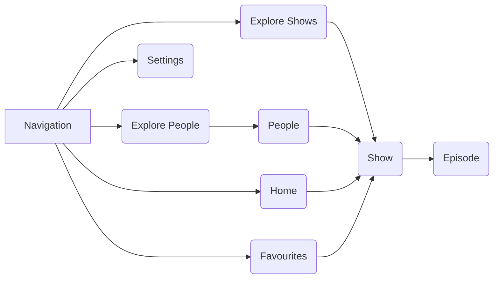

# Popcorn

TV show explorer and companion built with the [TvMaze API](https://www.tvmaze.com/), built in less than 3 days.

Important Packages
[Riverpod](https://pub.dev/packages/riverpod) for state management
[Dio](https://pub.dev/packages/dio) for networking
[Hive](https://pub.dev/packages/hive) for local storage

Application Flow Diagram

When cloning this project make sure to run generator
`flutter pub run build_runner build --delete-conflicting-outputs`
or `Make gen`
